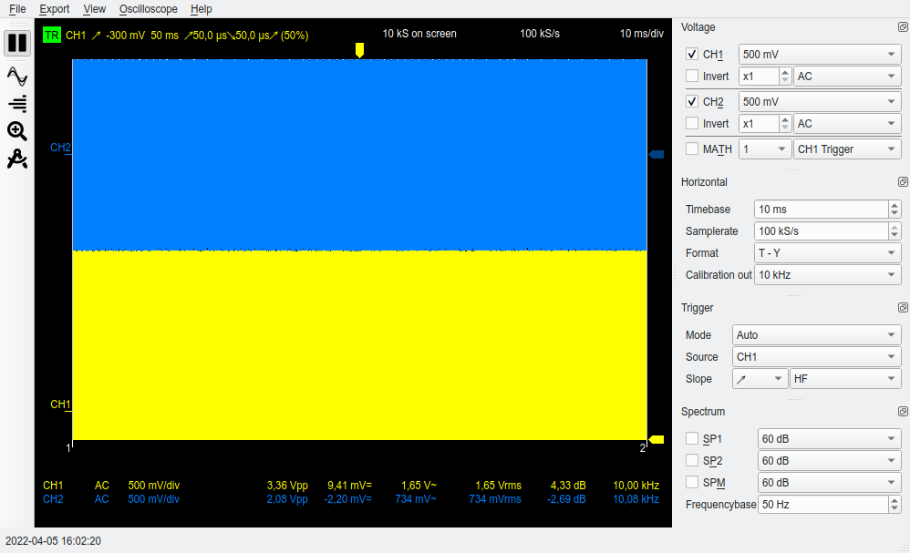
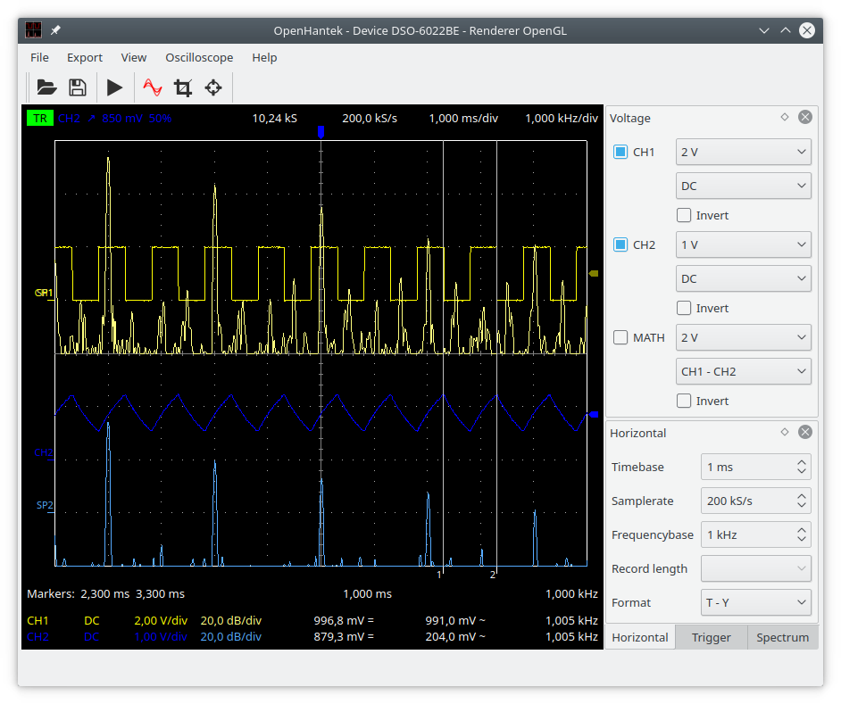

# Please Help the Victims of the War!
**Openhantek6022** is a project where people from all over the world collaborate peacefully, regardless of where they live.
If you are lucky enough to live in peace, please [**donate**](https://www.icrc.org/en/donate/ukraine) 
to the *International Committee of the Red Cross*.



# OpenHantek6022
[](https://github.com/OpenHantek/OpenHantek6022/actions/workflows/build_check.yml)
[](https://masterminds.github.io/stability/active.html)
[](https://github.com/OpenHantek/OpenHantek6022/releases)

[](https://github.com/OpenHantek/OpenHantek6022/releases/latest)
[](https://github.com/OpenHantek/OpenHantek6022/releases/latest)
[](https://github.com/OpenHantek/OpenHantek6022/releases/latest)

[](https://github.com/OpenHantek/OpenHantek6022/commits/main)
[](https://github.com/OpenHantek/OpenHantek6022/releases/tag/unstable)


OpenHantek6022 is a free software for **Hantek DSO6022** USB digital signal oscilloscopes that is actively developed on
[github.com/OpenHantek/OpenHantek6022](https://github.com/OpenHantek/OpenHantek6022) - but only for Hantek 6022BE/BL and compatible scopes (Voltcraft, Darkwire, Protek, Acetech, etc.).

**This project gives no support for its [currently unmaintained](https://github.com/OpenHantek/openhantek/issues/277) predecessor [openhantek](https://github.com/OpenHantek/openhantek).**

<p></p>

#### Content
* [About OpenHantek6022](#about-openhantek6022)
* [Features](#features)
* [AC Coupling](#ac-coupling)
* [Continuous Integration](#continuous-integration)
* [Building OpenHantek6022 from source](#building-openhantek6022-from-source)
* [Install Prebuilt Binary Packages](#install-prebuilt-binary-packages)
* [Run OpenHantek6022](#run-openhantek6022)
  + [Offset Calibration](#offset-calibration)
  + [OpenGL Support](#opengl-support)
  + [USB Access](#usb-access)
* [Important!](#important)
* [Specifications, Features, Limitations and Developer Documentation](#specifications-features-limitations-and-developer-documentation)
* [Contribute](#contribute)
* [Donate](#please-help-the-victims-of-the-war)
<!-- * [Donate for FSF](#donate-for-fsf) -->
* [Other DSO Open Source Software](#other-dso-open-source-software)
* [Other Related Software](#other-related-software)
* [History](#history)

## About OpenHantek6022
* Supported devices:
  - Hantek 6022BE and 6022BL as well as compatible scopes (e.g. Voltcraft DSO-2020).
  - SainSmart DDS120 (thx [msiegert](https://github.com/msiegert)) - this device has a different analog front end
 and uses the [slightly improved sigrok firmware](https://github.com/Ho-Ro/sigrok-firmware-fx2lafw), which has [some limitations](https://sigrok.org/wiki/SainSmart_DDS120/Info#Open-source_firmware_details)
 compared to the Hantek scopes (see [#69](https://github.com/OpenHantek/OpenHantek6022/issues/69#issuecomment-607341694)).

* Demo mode is provided by the `-d` or `--demoMode` command line option.
* Fully supported operating system: Linux; developed under debian stable (currently *bullseye*) for amd64 architecture.
* Raspberry Pi packages (raspbian stable) are available on the [Releases](https://github.com/OpenHantek/OpenHantek6022/releases) page, check this [setup requirement](docs/build.md#raspberrypi).
* Compiles under FreeBSD (packaging / installation: work in progress, thx [tspspi](https://github.com/tspspi)).
* Other operating systems builds: [Windows](docs/images/screenshot_mainwindow_win.png) (mostly untested) & macOS (completely untested).
  **No support for non-Linux related issues unless a volunteer steps in!**
* Uses [free open source firmware](https://github.com/Ho-Ro/Hantek6022API), no longer dependent on nonfree Hantek firmware.
* Extensive [User Manual](docs/OpenHantek6022_User_Manual.pdf) with technical specs and schematics.

## Features
* Voltage and Spectrum view for all device supported channels.
* CH1 and CH2 name becomes red when input is clipped (bottom left).
* Settable probe attenuation factor 1..1000 to accommodate a variety of different probes.
* Measure and display Vpp, DC (average), AC, RMS and dB (of RMS) values as well as frequency of active channels.
Display as *dBV* (0 dBV = 1 V rms), *dBu* (0 dBu = 1 mW @ 600 Ω) or *dBm* (0 dBu = 1 mW @ 50 Ω) can be selected in Oscilloscope/Settings/Analysis.
* Display the power dissipation for a load resistance of 1..1000 Ω (optional, can be set in Oscilloscope/Settings/Analysis).
* Display the THD of the signal (optional, can be enabled in Oscilloscope/Settings/Analysis).
* Show the note values and deviation in cent (*twelve equal*, A = 440 Hz) for audio frequencies (optional, can be enabled in Oscilloscope/Settings/Analysis). Useful to tune e.g. your electrical guitar.
* Math channel modes: CH1+CH2, CH1-CH2, CH2-CH1, CH1*CH2 and square, abs, sign, AC and DC part of CH1 or CH2.
* Time base 10 ns/div .. 10 s/div.
* Sample rates 100, 200, 500 S/s, 1, 2, 5, 10, 20, 50, 100, 200, 500 kS/s, 1, 2, 5, 10, 12, 15, 24, 30 MS/s (24 & 30 MS/s in CH1-only mode, 48 MS/s not supported due to unstable USB data streaming).
* Hardware input gain automatically selected based on vertical sensitivity: 1x (up to ±5 V for 1, 2 or 5 V/div), 2x (up to ±2.5 V for 500 mV/div), 5x (up to ±1 V for 200 mV/div) and 10x (up to ±500 mV for 20 or 50 mV/div).
* Downsampling (up to 200x) increases resolution and SNR.
* Calibration output square wave signal frequency can be selected between 32 Hz .. 100 kHz in small steps (*poor person's* signal generator).
A [little HW modification](docs/HANTEK6022_Frequency_Generator_Modification.pdf) provides a jitter free HW-driven calibration output signal instead of the interrupt driven SW-output.
* Trigger modes: *Normal*, *Auto* and *Single* with green/red status display (top left).
* Untriggered *Roll* mode can be selected for slow time bases of 200 ms/div .. 10 s/div.
* Trigger filter *HF* (trigger also on glitches), *Normal* and *LF* (for noisy signals).
* Display interpolation modes *Off*, *Linear*, *Step* and *Sinc*.
* Calibration values loaded from eeprom or a model configuration file.
* Online offset calibration creates a configuration file for persistent data storage.
* [Calibration program](https://github.com/Ho-Ro/Hantek6022API/blob/main/README.md#create-calibration-values-for-openhantek) to create these values automatically.
* Digital phosphor effect to notice even short spikes; simple eye-diagram display with alternating trigger slope.
* Histogram function for voltage channels on right screen margin.
* A [zoom view](docs/images/screenshot_mainwindow_with_zoom.png) with a freely selectable range.
* Cursor measurement function for voltage, time, amplitude and frequency.
* Export of the graphs to JPG, PNG or PDF file or to the printer; data export as CSV or JSON. 
* Freely configurable colors.
* Automatic adaption of iconset for light and [dark themes](docs/images/screenshot_mainwindow_dark.png).
* The dock views on the main window can be [customized](https://github.com/OpenHantek/OpenHantek6022/issues/161#issuecomment-799597664) by dragging them around and stacking them.
  This allows a minimum window size of 800*300 for old laptops or workstation computers.
* All settings can be saved to a configuration file and loaded again.
* French, German, Russian and Spanish localisation complete; Chinese, Polish and Swedish is updated regularily; Italian and Portuguese translation ongoing - [volunteers welcome](openhantek/translations/Translation_HowTo.md)!

## AC Coupling
A [little HW modification](docs/HANTEK6022_AC_Modification.pdf) adds AC coupling. OpenHantek6022 supports this feature since v2.17-rc5 / FW0204.

## Continuous Integration
Every commit triggers a workflow on
[GitHub Actions](https://github.com/OpenHantek/OpenHantek6022/actions/workflows/build_check.yml)
that builds and packages OpenHantek6022 for:
* Linux (`*.deb`, `*.rpm`, `*.tar.gz`)
* Windows (`*.zip`)
* macOS - (`*.dmg`, `*.tar.gz`)

[](https://github.com/OpenHantek/OpenHantek6022/actions/workflows/build_check.yml)
This status badge here (and on top) show the build status.

## Building OpenHantek6022 from source
The preferred way to run OpenHantek6022 is to build it from source on your system, especially under Linux.

The easiest way to get an up-to-date working code base is to clone the code from here via

````git clone https://github.com/OpenHantek/OpenHantek6022.git````

and then build it locally, for this you will need the following software:
* [CMake 3.5+](https://cmake.org/download/)
* [Qt 5.4+](https://www1.qt.io/download-open-source/)
* [FFTW 3+](http://www.fftw.org/) (prebuild files will be downloaded on windows)
* [libusb-1.0](https://libusb.info/), version >= 1.0.16 (prebuild files will be used on windows)
* A compiler that supports C++11 - tested with gcc, clang and msvc

We have build instructions available for [Linux](docs/build.md#linux), [Raspberry Pi](docs/build.md#raspberrypi), [FreeBSD](docs/build.md#freebsd), [Apple macOS](docs/build.md#macos) and [Microsoft Windows](docs/build.md#windows).

To make building for Linux even easier, I provide two shell scripts:
* [`LinuxSetup_AsRoot`](LinuxSetup_AsRoot), which installs all build requirements. You only need to call this script once (as root) if you have cloned the project.
* [`LinuxBuild`](LinuxBuild) configures the build, builds the binary and finally creates the packages (deb, rpm and tgz) that can be installed as described in the next paragraph.
If you make small changes to the local source code, it is sufficient to call `make -j4` or `fakeroot make -j4 package` in the `build` directory.

## Install Prebuilt Binary Packages
* [](https://github.com/OpenHantek/OpenHantek6022/releases/latest)
Download Linux (Ubuntu 2004 LTS), Raspberry Pi (Debian stable), FreeBSD (12.1), macOS (Big Sur 11.6) and Windows (Visual Studio 2019) packages for your convenience from the [Releases](https://github.com/OpenHantek/OpenHantek6022/releases) page.
* [](https://github.com/OpenHantek/OpenHantek6022/releases/tag/unstable)
If you want to follow ongoing development, packages built from a fairly recent commit are available in the rolling
[unstable release](https://github.com/OpenHantek/OpenHantek6022/releases/tag/unstable).
*Unstable* does not mean that the program will crash, but that individual features or elements of the GUI may still change.
* For RPi4 see also [issue #28](https://github.com/OpenHantek/OpenHantek6022/issues/28).
* These binary packages are built on stable operating system versions and require an up-to-date system.
* As I develop on a *Debian stable* system my preferred (native) package format is `*.deb`.
The program itself and the `*.deb` package built on my local system is tested for completeness and correctness.
The precompiled packages are only randomly tested - if at all - and the installation of the `*.rpm` packages is untested.
* To install the downloaded `*.deb` package, open a terminal window, go to the package directory and enter the command (as root) `apt install ./openhantek_..._amd64.deb`.
This command will automatically install all dependencies of the program as well.
* For installation of `*.rpm` packages follow similar rules, e.g. `dnf install ./openhantek-...-1.x86_64.rpm`.
* The `*.tar.gz` achives contain the same files as the `*.deb` and `*.rpm` packages for quick testing - do not use for a permanent installation. Do not report any issues about the `*.tar.gz`!
* Get macOS packages from [macports](https://www.macports.org/ports.php?by=name&substr=openhantek) - thx [ra1nb0w](https://github.com/ra1nb0w).
* Get [Fedora rpm packages](https://pkgs.org/download/openhantek) - thx [Vascom](https://github.com/Vascom).
* Download [(untested) builds from last commit(s)](https://github.com/OpenHantek/OpenHantek6022/actions/workflows/build_check.yml). Select the preferred `workflow run` and go to `Artifacts`.

## Run OpenHantek6022
On a Linux system start the program via the menu entry *OpenHantek (Digital Storage Oscilloscope)* or from a terminal window as `OpenHantek`.

You can explore the look and feel of OpenHantek6022 without the need for real scope hardware by running it from the command line as: `OpenHantek --demoMode`.

Note: To use the 6022BL in scope mode, make sure the "H/P" button is pressed before plugging in.

### Using Hantek 6022BL LA Function
The [Hantek6022BL](https://sigrok.org/wiki/Hantek_6022BL) can either be used as oscilloscope or as logic analyzer,
but not both at the same time - it is not a mixed-signal-oscilloscope (MSO).
If you want to use the LA part, then [sigrok](https://sigrok.org) is the way to go, it works (besides Linux) also for MacOS and Windows.
There is no point in supporting the LA input from OpenHantek.

### Offset Calibration
The oscilloscope has quite a large zero point error. To calibrate the offset quickly, simply proceed as follows:
1. Short-circuit both inputs, e.g. with a 50Ω terminating plug or by short-circuiting the probe inputs.
2. Activate the menu setting Oscilloscope/Calibrate Offset.
3. Set a slow timebase of 10..100 ms/div, resulting sample rate is 100..10 kS/s.
4. Slowly select all voltage settings for CH1 and CH2 one after the other.
5. Finally deactivate the menu setting Oscilloscope/Calibrate offset.

The offset correction is now active and is also permanently saved in EEPROM or as an `*.ini` file when switched off.

### OpenGL Support
OpenHantek6022 uses the *OpenGL* graphics library to display the data. It requires a graphics card that supports
3D rendering and runs on legacy HW/SW that supports at least *OpenGL* 2.1+ or *OpenGL ES* 1.2+.
*OpenGL* is selected by default, but if this does not work (i.e. the black scope window shows an error message
or closes immediately after startup), you can choose the less resource-hungry *OpenGL ES* variant as a fallback
by starting OpenHantek from the command line as follows: `OpenHantek -e` or `OpenHantek --useGLES`.

Especially on Windows, this option may be necessary to use the program.

The Raspberry Pi build uses OpenGL ES automatically, check also the [graphics driver setup](docs/build.md#raspberrypi).

### USB Access
USB access for the device is required (unless using demo mode):
* **_Linux/Unix_**  
You need to copy the file `utils/udev_rules/60-openhantek.rules` to `/etc/udev/rules.d/` or `/usr/lib/udev/rules.d/` and replug your device.
Note: If OpenHantek is installed from a `*.deb` or `*.rpm` package this file is installed automatically into `/usr/lib/udev/rules.d/`.
* **_Windows_**  
__Caution: The original Hantek driver for Windows doesn't work!__  
__You have to assign the correct WinUSB driver:__

  - The signed `.inf` file `OpenHantek.inf` for all devices - [provided by VictorEEV](https://www.eevblog.com/forum/testgear/hantek-6022be-20mhz-usb-dso/msg4418107/#msg4418107)
  and [updated](https://github.com/OpenHantek/OpenHantek6022/pull/323) by [gitguest0](https://github.com/gitguest0) - 
  is available in the `openhantek_xxx_win_x64.zip` [binary distribution](https://github.com/OpenHantek/OpenHantek6022/releases) in directory `driver`.

  - Right-click on `OpenHantek.inf` and select "install" from the pull-down menu.

  - The Device Manager will show (under "Universal Serial Bus devices") the name and state according to the firmware loaded (e.g. `Hantek 6022BE - Loader`, `Hantek 6022BE - OpenHantek`).
  The [PulseView/sigrok-cli](https://sigrok.org/) firmware is also recognized (e.g. `Hantek 6022BE - Sigrok`).

  It is recommended to use the `.inf` file, but it is also possible to alternatively use the [**Zadig**](docs/build.md#microsoft-windows-usb-driver-install-with-zadig) tool
  and follow the good [step-by-step tutorial](docs/OpenHantek6022_zadig_Win10.pdf) provided by [DaPa](https://github.com/DaPa).

## Important!
The scope doesn't store the firmware permanently in flash or eeprom, it must be uploaded after each power-up and is kept in ram 'til power-down.
If the scope was used with a different software (old openhantek, sigrok or the windows software) the scope must be unplugged and replugged one-time before using it with OpenHantek6022 to enable the automatic loading of the correct firmware.
The top line of the program must display the correct firmware version (FW0210).

## Specifications, Features, Limitations and Developer Documentation
I use this project mainly to explore how DSP software can improve and extend the [limitations](docs/limitations.md)
of this kind of low level hardware. It would have been easy to spend a few bucks more to buy a powerful scope - but it would be much less fun :)
Please refer also to the [developer info](docs/developer_info.md).

## Contribute
We welcome any reported GitHub issue if you have a problem with this software. Send us a pull request for enhancements and fixes. Some random notes:
   - Read [how to properly contribute to open source projects on GitHub][10].
   - Create a separate branch other than *main* for your changes. It is not possible to directly commit to main on this repository.
   - Write [good commit messages][11].
   - Use the same [coding style and spacing][13] -> install clang-format and use make target: `make format` or execute directly: `clang-format -style=file -i *.cpp *.h`.
   - It is mandatory that your commits are [Signed-off-by:][12], e.g. use git's command line option `-s` to append it automatically to your commit message:
     `git commit -s -m 'This is my good	commit message'`
   - Open a [pull request][14] with a clear title and description.
   - Read [Add a new device](docs/adddevice.md) if you want to know how to add a device.
   - We recommend QtCreator as IDE on all platforms. It comes with CMake support, a decent compiler, and Qt out of the box.

[10]: http://gun.io/blog/how-to-github-fork-branch-and-pull-request
[11]: http://tbaggery.com/2008/04/19/a-note-about-git-commit-messages.html
[12]: https://github.com/probot/dco/blob/master/README.md
[13]: http://llvm.org/docs/CodingStandards.html
[14]: https://help.github.com/articles/using-pull-requests

<!--
## Donate for FSF
If you really enjoy this project and would like to donate, please give it to the [Free Software Foundation](https://www.fsf.org/).
Without the FSF, we wouldn't have this [free software](https://www.gnu.org/philosophy/free-sw.html) that we can use today.
-->

## Other DSO Open Source Software
* [Firmware used by OpenHantek and python bindings for 6022BE/BL](https://github.com/Ho-Ro/Hantek6022API)
* [sigrok](http://www.sigrok.org)
* [Software for the Hantek 6022BE/BL (win only)](http://pididu.com/wordpress/basicscope/)

## Other Related Software
* [HScope for Android](https://www.martinloren.com/hscope/) A one-channel basic version is available free of charge (with in-app purchases).

## History
The program was initially developed by [David Gräff and others](https://github.com/OpenHantek/openhantek/graphs/contributors)
on [github.com/OpenHantek/openhantek](https://github.com/OpenHantek/openhantek),
but David [stopped maintaining](https://github.com/OpenHantek/openhantek/issues/277) the programm in December 2018. 
