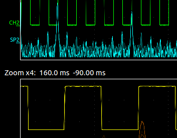

# OpenHantek  

OpenHantek is a free software for Hantek and compatible (Voltcraft/Darkwire/Protek/Acetech) USB digital signal oscilloscopes.

It has started as an alternative to the official Hantek DSO software for Linux users. Nowadays it works under Microsoft Windows and Apple Mac OS as well.

<table><tr>
    <td>  </td>
    <td>  </td>
</tr></table>

* Supported operating systems: Linux, MacOSX, Windows¹
* Supported devices: DSO2xxx Series, DSO52xx Series, 6022BE/BL

## Install prebuilt binary
Navigate to the [Releases](https://github.com/OpenHantek/openhantek/releases) page 

## Building OpenHantek from source
You need the following software, to build OpenHantek from source:
* [CMake 3.5+](https://cmake.org/download/)
* [Qt 5.4+](https://www1.qt.io/download-open-source/)
* [FFTW 3+ (prebuild files will be downloaded on windows)](http://www.fftw.org/)
* libusb 1.x (prebuild files will be used on windows)

You need a OpenGL 3.x capable graphics card for OpenHantek.

We have build instructions available for [Linux](docs/build.md#linux), [Apple MacOSX](docs/build.md#apple) and [Microsoft Windows](docs/build.md#windows).

## Run OpenHantek
Please be aware that you need USB access permissions. As seen on the [Microsoft Windows build instructions](docs/build.md#windows) page, you need a
special driver for Windows systems. On Linux, you need to copy the file `firmware/60-hantek.rules` to `/lib/udev/rules.d/` and replug your device.

## Specifications, Features and limitations
Please refer to the [Specifications, Features, Limitations](docs/limitations.md) page.

## Contribute
We welcome any reported Github Issue if you have a problem with this software. Send us a pull request for enhancements and fixes. Some random notes:
   - Read [how to properly contribute to open source projects on GitHub][10].
   - Create a separate branch other than *master* for your changes. It is not possible to directly commit to master on this repository.
   - Write [good commit messages][11].
   - Use the same [coding style and spacing][13]
     (install clang-format. Use make target: `make format` or execute directly from the openhantek directory: `clang-format -style=file src/*`).
   - Open a [pull request][12] with a clear title and description.
   - Read [Add a new device](docs/adddevice.md) if you want to know how to add a device.

[10]: http://gun.io/blog/how-to-github-fork-branch-and-pull-request
[11]: http://tbaggery.com/2008/04/19/a-note-about-git-commit-messages.html
[12]: https://help.github.com/articles/using-pull-requests
[13]: http://llvm.org/docs/CodingStandards.html

## Other DSO open source software
* [SigRok](http://www.sigrok.org)
* [Software for the Hantek 6022BE/BL only](http://pididu.com/wordpress/basicscope/)
