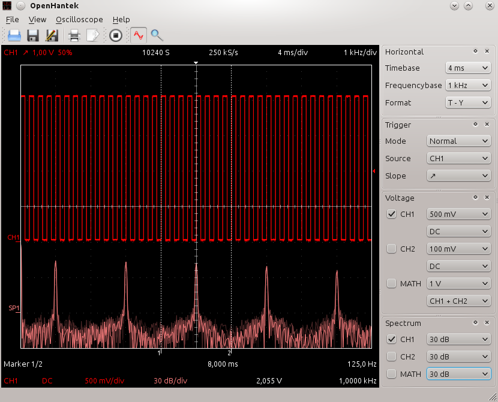

# OpenHantek  
OpenHantek is a free software for Hantek (Voltcraft/Darkwire/Protek/Acetech) USB digital storage oscilloscopes based on HantekDSO and has started as an alternative to the official Hantek DSO software.

Supported operating systems:
* Linux
* MacOSX
* Windows (You need to download the [WinUSB driver files](http://libusb-winusb-wip.googlecode.com/files/winusb%20driver.zip) and customize the inf file for your device yourself at the moment)

## Install prebuilt binary
Navigate to the [Releases](https://github.com/OpenHantek/openhantek/releases) page 

## Building OpenHantek from source
You need the following packages, to build OpenHantek from source:
* CMake 3.0+
* Qt 5.3+
* FFTW 3+ (prebuild files will be downloaded on windows)
* libusb 1.x (prebuild files will be downloaded on windows)

For debian based systems (Ubuntu, Mint) install named requirements like this:
> apt-get install cmake qttools5-dev-tools libfftw3-dev binutils-dev libusb-1.0-0-dev

For rpm based distributions (Fedora) use this command:
> dnf install cmake qt5-qtbase-gui qt5-qttools-devel qt5-qttranslations fftw-devel libusbx-devel binutils-devel libusb-1.0-0-devel

For MacOSX use homebrew
> brew update  
> brew install libusb fftw qt5;

After you've installed the requirements either run **cmake-gui** or run the following commands inside the directory of this package:
> mkdir build  
> cd build  
> cmake ../  
> make -j4 (for 4 concurrent compile jobs)  
> make install (optional, for installing only)

You can specify an install prefix when running cmake:
> cmake -DCMAKE_INSTALL_PREFIX=/usr

## Firmware
Your DSO does not store its firmware permanently -- the firmware has to be sent to the device each time it is connected. The `firmware` directory of this project contains the binary firmware extracted from Hantek's Windows drivers, and a udev rule to upload the firmware to the device automatically each time it is plugged in.

* You need binutils-dev autoconf automake fxload
* Install the `firmware/*.hex` files into `/usr/local/share/hantek/`.
* Install the `firmware/90-hantek.rules` file into `/etc/udev/rules.d/`.
* install fxload (fxload is a program which downloads firmware to USB  devices  based  on
       AnchorChips  EZ-USB, Cypress EZ-USB FX, or Cypress EZ-USB FX2 microcontrollers.)
* Add your current user to the **plugdev** group.

## Contribute
Please use Github Issues to report any problems or enhancements or send us pull requests. Some random notes:
   - Read [how to properly contribute to open source projects on GitHub][10].
   - Use a topic branch to easily amend a pull request later, if necessary.
   - Write [good commit messages][11].
   - Squash commits on the topic branch before opening a pull request.
   - Use the same coding style and spacing.
   - Open a [pull request][12] that relates to but one subject with a clear title and description
     
[10]: http://gun.io/blog/how-to-github-fork-branch-and-pull-request
[11]: http://tbaggery.com/2008/04/19/a-note-about-git-commit-messages.html
[12]: https://help.github.com/articles/using-pull-requests
